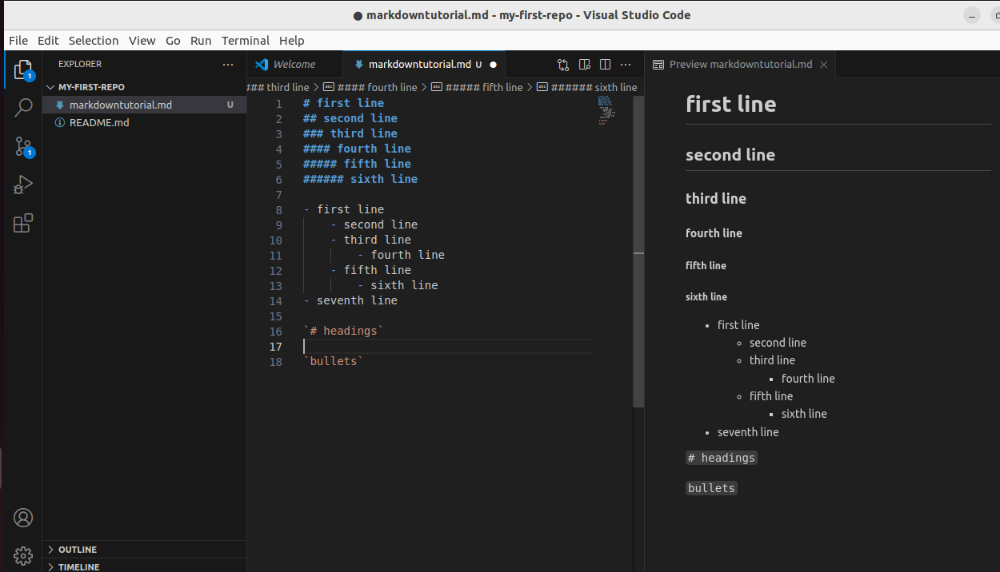
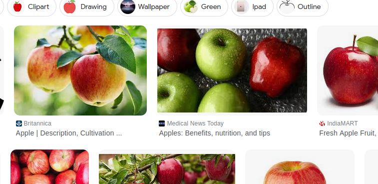

# first line
## second line
### third line
#### fourth line
##### fifth line
###### sixth line

- first line
    - second line
    - third line
        - fourth line
    - fifth line
        - sixth line
- seventh line

`# headings`

`bullets`




print("hello world")
```
print("hello world")
```

- i am from `sathyamangalam`